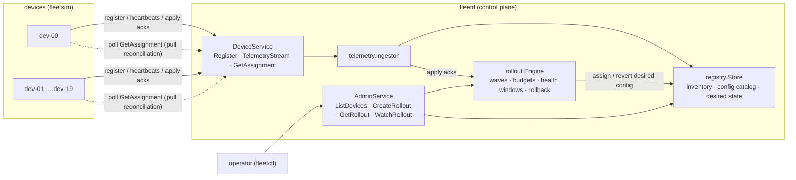

# fleet-ctl

[](https://github.com/ericsson-kuma/fleet-ctl/actions/workflows/ci.yml)
[](go.mod)
[](LICENSE)

A control plane for device fleets, in Go + gRPC: device registration,
streaming telemetry, and **staged config rollouts with SRE-style guardrails**
— canary waves, per-wave failure budgets, health-gated promotion, and
automatic rollback that bounds the blast radius of a bad config.

**[Rollout timeline, visualized →](https://ericsson-kuma.github.io/fleet-ctl/)**

## Why

Pushing config to a fleet of devices is a distributed-systems problem wearing
an ops costume. The failure mode that matters is not "the push failed" — it is
"the push *succeeded* onto ten thousand devices and the config was wrong."
The interesting engineering therefore lives in the control loop:

- **Gradual exposure.** New config reaches 5% of the fleet before it reaches
  100%, so a bad version is a canary incident, not an outage.
- **Evidence-based promotion.** A wave is promoted only after devices ack the
  apply and the wave soaks healthy for a window. Silence counts against the
  budget — an unresponsive device is not a healthy device.
- **Automatic containment.** When a wave's failure rate exceeds its budget,
  the rollout halts and every touched device is reverted to the previous
  baseline, without an operator in the loop.

This repo is the cloud side of the device↔cloud boundary I like working on —
it pairs with my mesh-steer-ml project, which lives on the device side of the
same boundary (on-device inference under cloud-rolled-out policy). It is a
deliberately small system with a clear API split, a rollout state machine
that is exact enough to unit-test at its boundaries, and a demo that shows
the guardrail actually firing.

## Architecture



Config distribution is **pull-based desired state**: the rollout engine only
edits the registry's desired-config assignments; devices converge by polling
`GetAssignment` and report the outcome over their telemetry stream. Rollback
is therefore the same mechanism as rollout — point the desired state back at
the old version — not a special code path on the device.

## Quickstart

Requires only the Go toolchain (generated proto code is committed;
`make proto` regenerates it if you change `api/fleet.proto`).

```console
$ make build          # bin/fleetd bin/fleetctl bin/fleetsim
$ bin/fleetd -listen 127.0.0.1:7443 &
$ bin/fleetsim -addr 127.0.0.1:7443 -n 20 -fail-rate 0.25 -fail-version v3 &

$ bin/fleetctl rollout -version v2 -blob '{"telemetry_interval":"30s"}' \
    -target all -waves 5,25,100 -threshold 0.2 -window 30s -watch
$ bin/fleetctl devices
$ bin/fleetctl status -id ro-1
```

Or let the demo drive everything:

```console
$ make demo
```

## The demo, abridged

`make demo` boots fleetd plus 20 simulated devices (25% of which reject v3),
then runs the two canonical rollouts. Good config first — every wave acks,
soaks, promotes:

```text
[ro-1] WAVE_STARTED  wave 0 (5%): 1 device(s) assigned v2, soaking 2s
[ro-1] DEVICE_OK     dev-00 applied v2 (1/1 ok)
[ro-1] WAVE_PROMOTED wave 0 healthy for 2s (1 ok, 0 failed, 0 silent of 1) — promoting
        ...
[ro-1] WAVE_PROMOTED wave 2 healthy for 2s (15 ok, 0 failed, 0 silent of 15) — promoting
[ro-1] SUCCEEDED     v2 is now fleet baseline (20 device(s))
```

Then the bad config. It survives the 5% canary (the one canary device happens
to tolerate it) and dies in the 25% wave the moment the failure budget blows:

```text
[ro-2] WAVE_STARTED  wave 1 (25%): 4 device(s) assigned v3, soaking 2s
[ro-2] DEVICE_OK     dev-01 applied v3 (1/4 ok)
[ro-2] DEVICE_OK     dev-02 applied v3 (2/4 ok)
[ro-2] DEVICE_FAIL   dev-03 failed to apply v3: simulated apply failure: config rejected by device
[ro-2] HALTED        wave 1 failure rate 1/4 exceeds threshold 20%
[ro-2] ROLLED_BACK   5 touched device(s) reverted to v2; 15 device(s) never exposed
```

`fleetctl rollout -watch` exits `3` when the guardrail fires, and the demo
script asserts that — the demo fails if the guardrail ever stops firing.

## Guardrail semantics (exact, on purpose)

| Rule | Definition |
|---|---|
| Waves | Cumulative fleet percentages (`5,25,100`), ceil'd per wave so a small canary still covers ≥ 1 device. Each wave owns its *delta* of devices. |
| Failure budget | Per-wave rate in `[0,1]`. A wave halts when `failures / wave size` is **strictly greater** than the budget — `rate == budget` is tolerated, because a budget means "at most". |
| Fast halt | Explicit failure acks alone can blow the budget mid-window; the engine does not wait for the window to end to stop the bleeding. |
| Health window | A wave promotes only after soaking for the window. At window end, devices that never acked count as failures — silence is not health. |
| Rollback | Reverts every device in *started* waves to the pre-rollout baseline. Devices in never-started waves were never touched: that bounded blast radius is the point of staging. |
| Idempotency | Terminal states are sticky. Straggler acks, duplicates, unrelated versions, and stale window timers are no-ops after halt/rollback. |

## Testing philosophy

The rollout engine never reads the wall clock — it gets a `clock.Clock`, and
tests inject a **fake clock whose timers fire synchronously and in deadline
order inside `Advance`**. That turns "wait 30s and hope" into a deterministic
state-machine test, which is what makes it honest to claim the guardrail
works: both sides of every edge are pinned by a test —

- failure rate just above the budget halts; **exactly at** the budget promotes
  (`TestThresholdBoundary`),
- unresponsive devices fail a wave at window end (`TestUnresponsiveDevices…`),
- rollback happens once and only once under a storm of late/duplicate acks and
  stale timers (`TestRollbackIsIdempotent…`),
- selectors scope both rollout and rollback (`TestSelectorScopes…`).

On top of that, `internal/server` runs both demo scenarios end-to-end over a
real gRPC stack on an in-process `bufconn` transport — real streams, real
clients, fake time. `go test -race ./...` is the CI gate.

## Layout

```
api/                fleet.proto + generated code (committed)
cmd/fleetd          control-plane server
cmd/fleetctl        operator CLI (stdlib flag; exit 3 = rolled back)
cmd/fleetsim        deterministic device-fleet simulator
internal/clock      injectable time; deterministic fake for tests
internal/registry   inventory, config catalog, desired state (Store interface)
internal/telemetry  ingest pipeline; routes apply acks to the engine
internal/rollout    the staged-rollout state machine
internal/server     gRPC layer; bufconn integration tests
docs/               rollout timeline visualization (GitHub Pages)
```

## Roadmap

Real, scoped next steps live in [BACKLOG.md](BACKLOG.md) — mTLS device
identity, bbolt persistence behind the existing `Store` interface, device
retry with backoff+jitter, Prometheus metrics, delta configs, and friends.

## License

[MIT](LICENSE)
